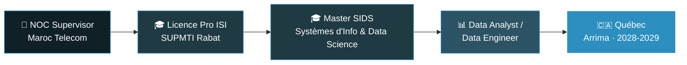

<p align="center">
  
</p>

<p align="center">
  
</p>

<p align="center">
  
  
  
  
</p>

<br>

## 👋 Salut, moi c'est El Mehdi

Je supervise le NOC de **Maroc Telecom** au quotidien, et en dehors des horaires tournants (2x2x2), je construis ma reconversion vers la **data** — méthodiquement, un projet à la fois. J'ai un profil réseaux/infra (Bac+2 Systèmes & Réseaux) et je complète actuellement une **Licence Pro Ingénierie des Systèmes d'Information** à SUPMTI Rabat, avant un Master SIDS (Systèmes d'Information et Data Science).

Ce que je code sert un objectif précis : passer de superviseur d'infrastructure à **Data Analyst / Data Engineer**, avec un horizon d'expatriation au **Québec** (programme Arrima) autour de 2028-2029.

```text
🎯 Focus actuel   : construire BienVérifié (SaaS full-stack) + Licence Pro
🌱 En cours       : Python for Everybody (Univ. Michigan)
💬 Demandez-moi   : automatisation Python, réseaux, data pipelines
⚡ Fun fact       : j'ai perdu 23kg en 7 mois en trackant mes données... les miennes, cette fois
```

<br>

## 🧭 Feuille de route



<br>

## 🚧 Ce que je construis en ce moment

### BienVérifié — SaaS de rapports immobiliers automatisés (France)
Génération automatique de rapports de due diligence immobilière : géocodage, transactions DVF, DPE, cadastre, risques (Géorisques), sites pollués (BASIAS/BASOL), export PDF stylé.

<p align="left">
  
  
  
  
  
</p>

> Dépôt privé (produit en cours de commercialisation) — architecture géospatiale + intégration multi-sources de données publiques françaises.

<br>

## 🧰 Stack technique

<table>
<tr>
<td valign="top" width="50%">

**Data & Analyse**
<br>


**Backend & Automatisation**
<br>


</td>
<td valign="top" width="50%">

**Réseau & Infra**
<br>


**En apprentissage**
<br>


</td>
</tr>
</table>

<br>

## 📌 Projets phares

| Projet | Description | Stack |
|---|---|---|
| 🏗️ **BienVérifié** | SaaS de rapports de due diligence immobilière (multi-sources géo) | FastAPI · PostGIS · Next.js · Stripe |
| ⛏️ [**paladium_farmer**](https://github.com/Khalifouille/paladium_farmer) | Bot d'automatisation pour Minecraft (Paladium) — OCR, capture d'écran, clics natifs `win32api`, vérification de synchronisation par niveau | Python · OpenCV · OCR |
| 🍔 [**burger-shot-commande-helper**](https://github.com/Khalifouille/burger-shot-commande-helper) | Système de commande avec pipeline de données intégré : capture, inscription automatique Google Sheets, stats de ventes temps réel | Python · Google Sheets API |
| 🎮 [**mudae-pokemon-automatiseur**](https://github.com/Khalifouille/mudae-pokemon-automatiseur) | Automatisation d'un bot Discord (Mudae) — logique de décision et gestion d'état | Python |
| ⚔️ [**vandal.js**](https://github.com/Khalifouille/vandal.js) | Wrapper TypeScript pour l'API de statistiques Valorant | TypeScript |
| 🚗 [**concessionnaire_helper**](https://github.com/Khalifouille/concessionnaire_helper) | Outil d'automatisation pour la gestion d'un concessionnaire (RP) | Python |

<details>
<summary>🕹️ Scripts & bots gaming plus anciens (19 dépôts) — cliquer pour dérouler</summary>
<br>

**Modules Lua — serveur RP "Crampté Land"** (systèmes de gameplay : ADN, carte d'identité, ceinture, chasse, douilles, iris, test de poudre, vendeur de cité, boosts d'interaction)
→ [`ch_adn`](https://github.com/Khalifouille/ch_adn) · [`ch_carte_didentite`](https://github.com/Khalifouille/ch_carte_didentite) · [`ch_ceinture`](https://github.com/Khalifouille/ch_ceinture) · [`ch_chasse`](https://github.com/Khalifouille/ch_chasse) · [`ch_douilles`](https://github.com/Khalifouille/ch_douilles) · [`ch_iris`](https://github.com/Khalifouille/ch_iris) · [`ch_test_poudre`](https://github.com/Khalifouille/ch_test_poudre) · [`ch_vendeur_de_cite`](https://github.com/Khalifouille/ch_vendeur_de_cite) · [`ch_youness`](https://github.com/Khalifouille/ch_youness) · [`ch_deco_veh`](https://github.com/Khalifouille/ch_deco_veh) · [`ch_caca_boost`](https://github.com/Khalifouille/ch_caca_boost)

**Bots d'automatisation (Python/JS)** — mes premiers pas en automatisation, depuis 2020
→ [`extinc_farmer`](https://github.com/Khalifouille/extinc_farmer) · [`extinction-autobuy`](https://github.com/Khalifouille/extinction-autobuy) · [`CTFISHING-BOT`](https://github.com/Khalifouille/CTFISHING-BOT) · [`LBRP-MINEUR_FOU`](https://github.com/Khalifouille/LBRP-MINEUR_FOU) · [`ExtincFarm-BOT`](https://github.com/Khalifouille/ExtincFarm-BOT) · [`SweeBug-BOT`](https://github.com/Khalifouille/SweeBug-BOT) · [`ThePointeur78-BOT`](https://github.com/Khalifouille/ThePointeur78-BOT) · [`DankMemer-BOT`](https://github.com/Khalifouille/DankMemer-BOT)

**Divers**
→ [`recensements_fusillade_mcd_no_face`](https://github.com/Khalifouille/recensements_fusillade_mcd_no_face) · [`divers_petit_projets`](https://github.com/Khalifouille/divers_petit_projets)

</details>

<br>

## 📊 Stats GitHub

<p align="center">
  
  
</p>

<p align="center">
  
</p>

<br>

## 🐍 Contribution snake

<p align="center">
  
  
</p>

> ⚙️ Cette animation se génère automatiquement chaque jour via GitHub Actions (workflow `.github/workflows/snake.yml` fourni à côté de ce fichier). Voir les instructions d'installation en fin de conversation.

<br>

## 📜 Certifications & formation

| Certification / Diplôme | Émetteur | Statut |
|---|---|---|
| 🏅 Google Data Analytics Certificate | Google / Coursera | ✅ Obtenu |
| 🏅 Cisco Networking Basics | Cisco | ✅ Obtenu — oct. 2025 |
| 🔄 Python for Everybody | Univ. Michigan | 🔄 En cours |
| 🎓 Licence Pro Ingénierie des SI | SUPMTI Rabat | 🔄 En cours |
| 🎯 Master SIDS (Systèmes d'Info & Data Science) | — | 🎯 Prochaine étape |
| 🎯 CCNA → AZ-900 → AZ-104 → AZ-700 → ITIL 4 | Cisco / Microsoft / Axelos | 🎯 Feuille de route |

<br>

<p align="center">
  
</p>

<p align="center"><i>Merci d'être passé(e) 👋 — n'hésitez pas à me contacter pour échanger data, réseaux ou automatisation.</i></p>